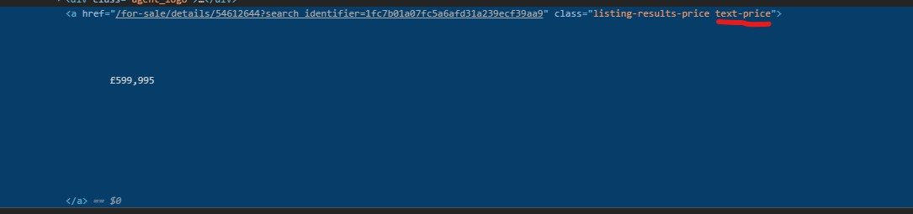

# Web Scraping Step by Step

For the python discord I will demonstrate a simple webscraping job that gathers some price information
on houses in London


* [Start](#start)

## Start

First we want to make sure that we have a clean working environment. 
I will be using PyCharm for this as it is what I am comftarble with but it is not required.
A simple text editor or JyupterNotebook would also be fine. It really doesn't matter.

### Creating a virtual environment

Since I am treating this as a completely new project I will start with creating a new environment to 
make sure that all my dependencies are isolates.

In PyCharm, once you have created a project you can do this under 

`File->Settings`


`Project Interpreter->DropDown->Show All`


`+->New Environment->Okay`


Okay - now you are running with a new environment. Great!

## Understanding the Website

Let us first manually checkout what we are looking at so lets go to 

[zoopla](https://www.zoopla.co.uk/)

and search for something - lets use...London because I am not from the UK and that is obviously the first city I think of

Lets also filter to houses and hit search.

The first thing you need to understand is that we are always requesting certain information from a server. Therefore
we just need to know how the browser is asking the server for the information and using that for our advantage

Once you hit search let us examine the URL: 
`https://www.zoopla.co.uk/for-sale/houses/london/?q=London&results_sort=newest_listings&search_source=home`

Okay - interesting - in there we can already see that it is filtering stuff.

We wanted `houses` well it says /for-sale/`houses`/london
We wanted `london` well it says /for-sale/houses/`london`/?q=`London`

so that is a good starting point

Let us see what the URL for the next page looks like. It changed quite a bit but I like it more

`https://www.zoopla.co.uk/for-sale/houses/london/?identifier=london&property_type=houses&q=London&search_source=home&radius=0&pn=2`

In here we have probably more or less all the things that we need. Property Type, identifier, radius, page number.

Great!!!!

## Digesting the HTML

Whenever your browser makes a request to a website it really always just returns a text file. And now our job is it to 
understand how this text file is structured to get the data we want.

When you hit `F12` on your Browser you will open your developer tools (or ctrl+shit+I)

They look something like this


Make sure to click `Elements at the very top` and then hit the little mouse pointer clicky thing

With this tool active you can now select "stuff" on the site and it will show you where in the HTML it comes from


So this is where the price for the first listing is hidden! Great.

If we go up the HTML tree we can probably also find the container that contains _all_ listings on this page

This guy seems to be perfect


Now we just need a way to find this guy without having to do it manually. So right click the element and say 
`Copy-> Copy Selector`


The selector is `#content > ul` so we can now select the node that contains all listings. Great

We should probably start jumping into some code now!


## Getting Coding

Let us first make sure we have all the dependencies that we will need. For ease of use we will use `requests` to get
the page. And `beautifulsoup` to then digest it and get the info that we need. So without further ado

Go back to the interpreter settings and hit plus on the right to install more dependencies


Install requests


Install bs4


Now in your main python file we can actually start getting the page!

```python
import requests
from bs4 import BeautifulSoup

def get_listings(location='london', property_type='houses', page=1):
    url = f"https://www.zoopla.co.uk/for-sale/houses/{location}/?identifier={location}&property_type={property_type}&search_source=home&radius=0&pn={page}`
    requests_result = requests.get(url)
    if requests_result.status_code != 200:
        raise RuntimeError("Could not successfully fetch", url)
    content = requests_result.text
    print(content)

if __name__ == '__main__':
    get_listings()
```
So first we just import our modules, define a funciton to get some listings for a location, propertype and pagenumer
And then we print the content of the page.

If the status code is not 200 something went wrong so we make sure that we let everyone know.

When you run this you will see the printed HTML string in your console


So now lets parse it with bs4

```python
soup = BeautifulSoup(content, 'html.parser')
```

Well that was easy!

so now lets also try to find our listing container from earlier

```python
container_listings = soup.select('#content > ul')
print(container_listings)
```

#### Side Note
Something important here!
We are currently gathering data from someone else by requesting stuff from their server. Servers cost money and 
we are not making them any money - so it is advisable to be _nice_ This means - don't hammer the server with requests 
but give it some breathing time.
For testing it may often make sense to just query the site once - save the content and just work off of that until
you are ready to test it again with the actual server!


Lets see what we get now 


Great - some more output - it is in a list and the length of that list is 1 which is good because we only want to have 
one container with all the listings

But maybe we should actually select all the list elements right away so lets go with `#content > ul > li`

Great - running that gives us 27 listings

But what we care about is the price for each of those listings

So lets see how we could identify the price in those listing elements.
When we look at it again we can see that the price has a class named `text-price`



That sounds pretty promising so lets go over every listing and check the price. We have to make sure that we actually
found a price -if not well then lets just `continue` with the next listing

```python
for listing in container_listings:
    text_price_element = listing.select('.text-price')
    if len(text_price_element) < 1:
        continue
    print(text_price_element[0].get_text().strip())
```

Last but not least we have to clean up the data. Currently it looks like this


We don't want all that text in there and  the '£' doesn't help us either. So lets do some cleanup.
Usually I would use `regular expressions` for this. But I don't want to extend the scope of this. So lets just use
list comprehensions

```python
price_string = ''.join(c for c in text_price_element[0].get_text() if c.isdigit())
# not a valid price so let us just continue
if len(price_string) <= 0:
    continue
print(price_string)
price = int(price_string)
```

There we go - now we have the price for every listing! Wasn't that fun?!?!

But wait there is more - we also want to save the data - so the easiest is to probably just store everything in a list
of dictionaries and then jsut save that as json to a file. So let us do that really quick and then we shall be done

```python
results = []
...
results.append({"price": price})
...

return results
```

Now when we call the function we get a lits of dictionaries back - so we can save it to our entire set. And then write it to 
file

so in your main function we can now save all the pages and then once we are done write them to disk as json

dont forget to also
```python
import json
import time
```

```python
if __name__ == '__main__':
    all_results = []
    for i in range(1, 10, 1):
        page_result = get_listings(page=i)
        all_results.extend(page_result)
        # wait some time so we don't hammer the server with requests!
        time.sleep(1)

    with open("result.json", "w") as f:
        json.dump(all_results, f)
```

And there we have it!!!

## Future Work

Well now we have extracted the price for a listing - but we need to get some more information. This is now up to you!


